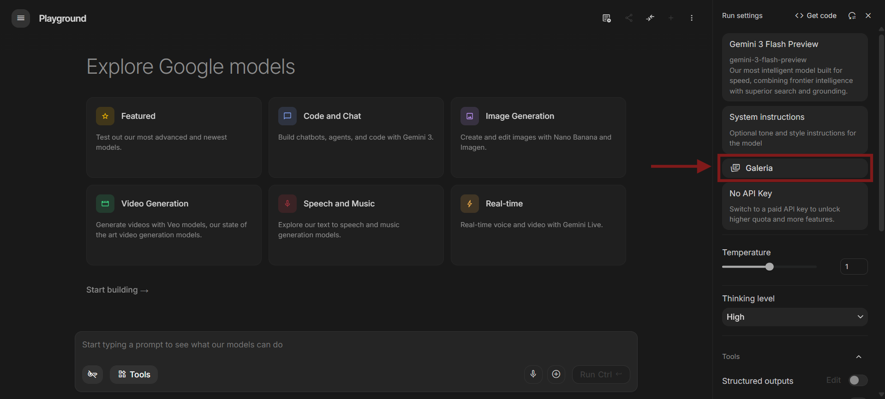

# Visão Geral e Interface

Este documento descreve a interface e as funcionalidades básicas da extensão AI Studio Superpowers. 

Após ler este guia, você será capaz de:
* Localizar os painéis da extensão dentro do Google AI Studio.
* Navegar entre Prompts e Anotações.
* Alterar o layout de visualização.
* Reordenar seus itens salvos.

Este documento não aborda a criação de prompts ou configurações de nuvem. Para esses tópicos, consulte as seções específicas no menu lateral.

---

## Localizar as ferramentas

A extensão adiciona dois controles principais à interface nativa do Google AI Studio:

1.  **Botão Galeria:** Localizado abaixo do painel de *System Instructions* (Instruções do Sistema). Clique neste botão para abrir seu banco de dados de prompts.
    
    

2.  **Botão Exportar Conversa:** Localizado no canto superior direito do painel de chat. Clique neste botão para baixar ou copiar o histórico da conversa atual.

---

## Navegar na Galeria

A Galeria é o painel central da extensão. Ela contém os seguintes elementos principais:

*   **Barra de Ferramentas (Superior):** Fornece um campo de busca textual e uma barra de filtros por Etiquetas (Tags).
*   **Abas de Visualização:** Permitem alternar entre os seus **Prompts** e as suas **Anotações**.
*   **Botões de Ação (Canto inferior direito):** Fornecem as opções para criar um novo documento (`+`) ou importar o texto atual da tela do AI Studio.
*   **Rodapé:** Fornece menus para gerenciar seus Workspaces e configurar a sincronização com o GitHub.

---

## Alterar o layout da Galeria

Você pode alterar a forma como a Galeria exibe seus dados. 

Para alterar o layout, siga estes passos:
1. Abra a Galeria.
2. Clique no menu de layouts, localizado no canto superior direito do painel.
3. Selecione uma das seguintes opções:
   * **Galeria:** Exibe cards grandes. Recomendado para visualizar descrições detalhadas.
   * **Compacto:** Reduz o espaçamento dos cards. Recomendado para visualizar mais itens simultaneamente.
   * **Lista:** Oculta as descrições e exibe os dados em formato de tabela de linha única. Recomendado para workspaces com alto volume de itens.

---

## Reordenar itens

Você pode organizar a ordem dos seus prompts, anotações e workspaces.

Para alterar a posição de um item:
1. Clique e segure o cursor sobre o card ou item da lista.
2. Arraste o item para a nova posição. (Uma linha azul indica o local de destino).
3. Solte o botão do mouse.

A extensão salva a nova ordem localmente de forma automática.